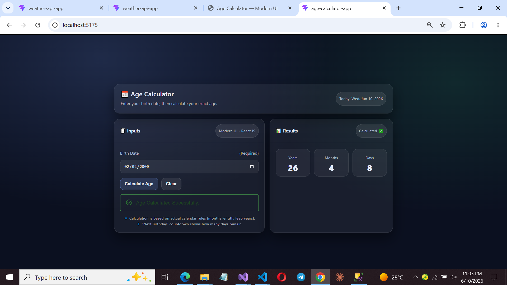

# 🧮 Age Calculator App

A modern and responsive Age Calculator built with React (Vite), designed to compute precise age based on a given date of birth. This project was developed to strengthen core programming fundamentals, improve logical thinking, and practice modern React concepts including state management with Redux.

📌 Project Overview

The Age Calculator App allows users to input their date of birth and instantly calculate their exact age in years, months, and days.

## 📌 About The Project

The Age Calculator App allows users to input their date of birth and instantly calculate their exact age in:

- Years
- Months
- Days

This project focuses on building strong programming logic and understanding how date calculations work under the hood, while also applying modern React patterns.

## 🛠️ Tech Stack

- React (Vite)
- JavaScript (ES6+)
- Redux Toolkit
- HTML5
- CSS

---

## ✨ Features

- 📅 Date of birth input
- ⚡ Instant age calculation
- 📊 Detailed output (years, months, days)
- 🔁 State management with Redux
- 📱 Fully responsive design
- 🎨 Clean UI
- 🚀 Fast performance with Vite

---

## 🧠 What I Learned

- JavaScript date manipulation
- React component structure
- Redux Toolkit state management
- Clean project architecture
- UI structuring and responsiveness
- Using Vite for modern frontend setup

---
## 📸 Screenshot

